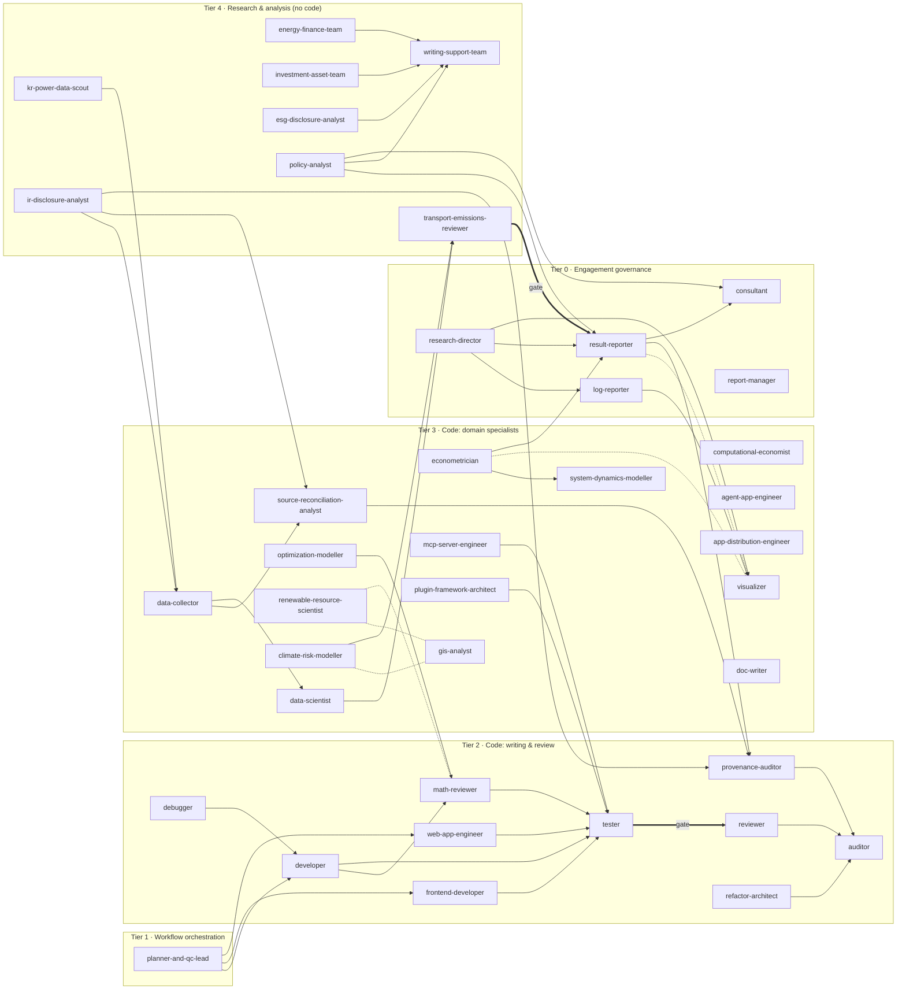
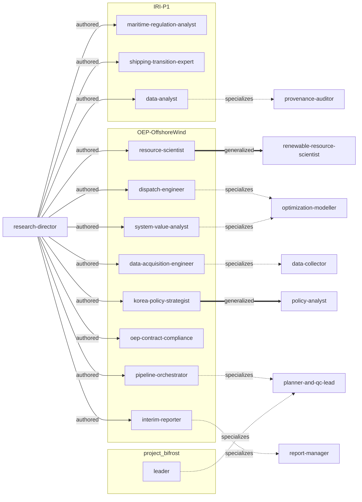

# Agent Ontology

> **Generated file — do not edit by hand.** Source of truth: [`ontology.yaml`](ontology.yaml). Regenerate with `uv run --no-project --with pyyaml python scripts/render_ontology.py`.

> For the **interactive version** — a clickable map with each agent's full role and routing boundaries — open [`ontology.html`](ontology.html) (self-contained, offline, opens by double-click; regenerate with `uv run --no-project --with pyyaml python scripts/render_ontology_html.py`).

40 user-level agents (installed to `~/.claude/agents/`) and 12 project-scoped agents (mirrored under [`project/`](project/README.md), not installed globally). Nodes are agents; edges are typed relationships. The full role reference is [`README.md`](README.md); this document is the machine-readable relationship graph.

## Tiers

| Tier | Name | When |
|---|---|---|
| 0 | Engagement governance | Work bound by a contract, proposal, or funding agreement; artefacts under claude-docs/. |
| 1 | Workflow orchestration | The start of any non-trivial task — plan, decompose, route. |
| 2 | Code: writing & review | Writing code and the gates that guard it before merge. |
| 3 | Code: domain specialists | Code in a specific modelling or engineering domain. |
| 4 | Research & analysis (no code) | Desk research and written deliverables; no code. |

## Relationship types

| Edge | Meaning |
|---|---|
| `hands_off_to` | A produces work B takes as its input in a standard workflow (a direction of flow). |
| `gates` | A is a mandatory pass/fail check that must clear before B proceeds. |
| `delegates_to` | A's own description routes a neighbouring task away to B ("NOT for X — use B"). |
| `pairs_with` | A and B collaborate on one task, neither downstream of the other (symmetric). |
| `authored` | A (research-director) created this project-scoped agent for one engagement. |
| `specializes` | a project-scoped agent is a narrowed, engagement-bound form of user-level B. |
| `generalized_as` | a project-scoped agent was distilled into user-level agent B (use B for new work). |

## Flow & gates (user-level pack)

Solid = `hands_off_to`; thick = `gates`; dotted = `pairs_with`. Boundary routing (`delegates_to`) is listed exhaustively in the tables below and omitted from the diagram for legibility.

## Project layer

The 12 project-authored agents and how they relate to the pack: `authored` by `research-director`, `specializes` a user-level agent, or was `generalized_as` a new one.

## Agents

### User-level

| Agent | Tier | Model | Access | Role |
|---|---|---|---|---|
| [`consultant`](consultant.md) | 0 | opus | read-write | The only customer-facing role — engagement + plain-language translation; drafts only, never sends, never accepts scope |
| [`log-reporter`](log-reporter.md) | 0 | opus | read-write | The log report per unit — what was done and what failed: commands, environment, fingerprints, dead ends, deviations, reproduction |
| [`report-manager`](report-manager.md) | 0 | opus | read-write | Process-conformance governance + generated HTML progress & team dashboards; reads the docs, never edits them |
| [`research-director`](research-director.md) | 0 | opus | read-write | Owns research design & governance from the contract — charter, phases, stages, process, toolbox, tracker, team, and the reports/ record set |
| [`result-reporter`](result-reporter.md) | 0 | opus | read-write | The result report per unit — the analysis as a journal article, plus a conference-presentation deck; data handling, statistics, figures |
| [`planner-and-qc-lead`](planner-and-qc-lead.md) | 1 | opus | read-only | Plans a non-trivial task, decomposes it into reviewable steps, produces a QC checklist, routes to agents |
| [`auditor`](auditor.md) | 2 | opus | read-only | Pre-merge code audit — no hardcoded values, config externalised, pint, tooling, layout |
| [`debugger`](debugger.md) | 2 | opus | read-write | Reproduce → isolate root cause → minimal fix; failing test before the fix |
| [`developer`](developer.md) | 2 | opus | read-write | Implements/refactors/documents scientific-modelling Python to CLAUDE.md conventions |
| [`frontend-developer`](frontend-developer.md) | 2 | opus | read-write | Rich React + TypeScript + Vite modelling-GUI browser client |
| [`math-reviewer`](math-reviewer.md) | 2 | opus | read-only | Verifies code vs Algorithm docstrings & ALGORITHM.md — stability, signs, indexing, tolerances |
| [`provenance-auditor`](provenance-auditor.md) | 2 | opus | read-only | Data-provenance & republication-licence audit; every figure traces; clean-checkout reproducibility |
| [`refactor-architect`](refactor-architect.md) | 2 | opus | read-write | Behavior-preserving restructure — extract, deduplicate, reduce coupling, remove dead code |
| [`reviewer`](reviewer.md) | 2 | opus | read-only | APPROVE/REJECT a diff against the one task asked; scope creep, duplication, contract |
| [`tester`](tester.md) | 2 | sonnet | read-only | Mechanical build gate — tsc/mypy, compile, plain ruff, emoji scan, tests; pass/fail only |
| [`web-app-engineer`](web-app-engineer.md) | 2 | opus | read-write | No-build vanilla-JS/d3 web apps + thin FastAPI/http.server backend + static/Vercel deploy |
| [`agent-app-engineer`](agent-app-engineer.md) | 3 | opus | read-write | LLM/agent applications — Agent SDK, provider abstraction, guards, budgets, RAG, eval |
| [`app-distribution-engineer`](app-distribution-engineer.md) | 3 | opus | read-write | Double-click .command/.bat/.ps1 launchers for non-technical users; first-run bootstrap |
| [`climate-risk-modeller`](climate-risk-modeller.md) | 3 | opus | read-write | CLIMADA physical risk (hazard×exposure×vulnerability, EAI) + NGFS transition risk |
| [`computational-economist`](computational-economist.md) | 3 | opus | read-write | Equilibrium & mechanism modelling — PE/GE, Nash-Cournot, Hotelling, carbon markets |
| [`data-collector`](data-collector.md) | 3 | opus | read-write | Ingestion pipelines — scrapers/APIs, schema validation, retry/backoff, idempotent storage |
| [`data-scientist`](data-scientist.md) | 3 | opus | read-write | EDA, statistics, ML prototyping in code; schema/dtype/unit alignment; parquet > CSV |
| [`doc-writer`](doc-writer.md) | 3 | opus | read-write | Code-facing docs — README, CLI manuals, tutorials, ARCHITECTURE, CONTRIBUTING |
| [`econometrician`](econometrician.md) | 3 | opus | read-write | Reduced-form causal inference — DiD (staggered-robust), event studies, panel FE, IV/RD, pass-through; owns the estimand and the clustering |
| [`gis-analyst`](gis-analyst.md) | 3 | opus | read-write | Geospatial code — CRS, spatial joins, raster/vector, choropleth binning |
| [`mcp-server-engineer`](mcp-server-engineer.md) | 3 | opus | read-write | MCP server tool surface — granularity, schemas, recoverable errors, output budgeting, parity |
| [`optimization-modeller`](optimization-modeller.md) | 3 | opus | read-write | LP/MILP/NLP + PyPSA network construction, power flow (n.pf()) and calibration |
| [`plugin-framework-architect`](plugin-framework-architect.md) | 3 | opus | read-write | The host↔plugin contract — SDK surface, entry-point discovery, version negotiation, isolation guards, composition, strangler extraction |
| [`renewable-resource-scientist`](renewable-resource-scientist.md) | 3 | opus | read-write | Wind/solar resource from reanalysis — hub-height extrapolation, bias correction, capacity factors |
| [`source-reconciliation-analyst`](source-reconciliation-analyst.md) | 3 | opus | read-write | Reconcile disagreeing sources; record the rule; preserve the losing value; gate on tolerance |
| [`system-dynamics-modeller`](system-dynamics-modeller.md) | 3 | opus | read-write | Stock-and-flow feedback simulation — integration, loop dominance, Vensim/.mdl |
| [`visualizer`](visualizer.md) | 3 | opus | read-write | Charts/maps/dashboards in code — matplotlib/seaborn/plotly/folium/pydeck; builds the research report pages and their index |
| [`energy-finance-team`](energy-finance-team.md) | 4 | opus | research | Energy/ESG/climate/policy research → structured report |
| [`esg-disclosure-analyst`](esg-disclosure-analyst.md) | 4 | opus | research | Disclosure standards — GHG Protocol / Scope 3 Cat. 11, avoided emissions, PCAF, ISSB & adoptions, CSRD, SBTi, taxonomies; positions a metric, reads a disclosure, writes for standard-setters |
| [`investment-asset-team`](investment-asset-team.md) | 4 | opus | research | Portfolio/equity/bond/credit/risk research → structured investment report |
| [`ir-disclosure-analyst`](ir-disclosure-analyst.md) | 4 | opus | research | Company IR / operating releases as data — basis, boundary, period, granularity, vintage per release; reporting-basis map; build-vs-buy verdict on licensed datasets |
| [`kr-power-data-scout`](kr-power-data-scout.md) | 4 | opus | research | Korean datasets + what a metric actually measures (설비 vs 발전, 발전단 vs 송전단, SMP vs 정산단가) |
| [`policy-analyst`](policy-analyst.md) | 4 | opus | research | Instrument register, target anatomy, policy use-case fit, audience and storyline — shaped before computing; comparison, never cause |
| [`transport-emissions-reviewer`](transport-emissions-reviewer.md) | 4 | opus | read-only | Methodology gate for road-fleet and shipping emissions models — segment ratio, real-world factors, grid rule, lifetime, WtW/TtW, P10/P50/P90; read-only, before publication |
| [`writing-support-team`](writing-support-team.md) | 4 | opus | research | Reports, white papers, briefs, memos, presentations; parallel KO/EN with a terminology glossary |

### Project-scoped

| Agent | Project | Tier | Model | Role |
|---|---|---|---|---|
| [`data-analyst`](project/IRI-P1/data-analyst.md) | IRI-P1 | 3 | opus | Transcription-with-provenance into a sqlite register — verbatim quote + exact locator; refuses to fill a gap |
| [`maritime-regulation-analyst`](project/IRI-P1/maritime-regulation-analyst.md) | IRI-P1 | 3 | opus | Primary-source IMO regulation — adopted vs draft text, GFI/RU/SU basis, vessel-activity data |
| [`shipping-transition-expert`](project/IRI-P1/shipping-transition-expert.md) | IRI-P1 | 3 | opus | Marine-fuel transition sector authority; carries PLANiT's published shipping position; produces no figure |
| [`data-acquisition-engineer`](project/OEP-OffshoreWind/data-acquisition-engineer.md) | OEP-OffshoreWind | 3 | sonnet | SKR-0008 acquisition layer — fetchers + credential broker + human-input inbox; always a manifest |
| [`dispatch-engineer`](project/OEP-OffshoreWind/dispatch-engineer.md) | OEP-OffshoreWind | 3 | opus | KPG193 network build, 2024 calibration gate, scenario encoding, ensembled run matrix |
| [`interim-reporter`](project/OEP-OffshoreWind/interim-reporter.md) | OEP-OffshoreWind | 0 | sonnet | Stage reports that lead with the ask and are honest about failure |
| [`korea-policy-strategist`](project/OEP-OffshoreWind/korea-policy-strategist.md) | OEP-OffshoreWind | 4 | opus | Storyline for MCEE/KPX/National-Assembly audiences; the three contract-required Korea insights |
| [`oep-contract-compliance`](project/OEP-OffshoreWind/oep-contract-compliance.md) | OEP-OffshoreWind | 0 | sonnet | Pre-submission PASS/BLOCK vs Schedules 1/2/3, payment gateways, KPIs |
| [`pipeline-orchestrator`](project/OEP-OffshoreWind/pipeline-orchestrator.md) | OEP-OffshoreWind | 1 | opus | START HERE project lead — reads pipeline state, dispatches to role agents, batches asks |
| [`resource-scientist`](project/OEP-OffshoreWind/resource-scientist.md) | OEP-OffshoreWind | 3 | opus | Offshore-wind resource module — ERA5, shear, bias correction vs buoys, capacity factors |
| [`system-value-analyst`](project/OEP-OffshoreWind/system-value-analyst.md) | OEP-OffshoreWind | 3 | opus | System LCOE, curtailment, LCoS, surplus absorption — metrics as differences between scenarios |
| [`leader`](project/project_bifrost/leader.md) | project_bifrost | 1 | inherit | Feature triage → scoped task to developer → reviewer → commit/push/merge |

## Relationships

### `hands_off_to`

- `research-director` &rarr; `log-reporter` — the operational record per unit — what was done, what failed
- `research-director` &rarr; `result-reporter` — the analysis article and its presentation deck per unit
- `log-reporter` &rarr; `visualizer` — the navigable record page
- `result-reporter` &rarr; `provenance-auditor` — licence and trace clearance before the result set travels
- `result-reporter` &rarr; `consultant` — audience framing when a deck goes to a client
- `research-director` &rarr; `visualizer` — builds reports/_build/
- `planner-and-qc-lead` &rarr; `developer`
- `planner-and-qc-lead` &rarr; `frontend-developer`
- `planner-and-qc-lead` &rarr; `web-app-engineer`
- `developer` &rarr; `math-reviewer` — if math changed
- `optimization-modeller` &rarr; `math-reviewer` — mandatory when formulation changes
- `math-reviewer` &rarr; `tester`
- `developer` &rarr; `tester`
- `frontend-developer` &rarr; `tester`
- `web-app-engineer` &rarr; `tester`
- `mcp-server-engineer` &rarr; `tester`
- `reviewer` &rarr; `auditor` — reviewer before commit
- `debugger` &rarr; `developer`
- `refactor-architect` &rarr; `auditor`
- `plugin-framework-architect` &rarr; `tester` — the isolation guards and the lean-composition matrix
- `econometrician` &rarr; `system-dynamics-modeller` — an estimate consumed across its interval
- `econometrician` &rarr; `result-reporter` — the estimate with its design
- `kr-power-data-scout` &rarr; `data-collector` — dossier → build the fetcher
- `data-collector` &rarr; `source-reconciliation-analyst` — if it overlaps a source we hold
- `data-collector` &rarr; `data-scientist` — analyse what was collected
- `source-reconciliation-analyst` &rarr; `provenance-auditor`
- `provenance-auditor` &rarr; `auditor`
- `energy-finance-team` &rarr; `writing-support-team` — formal document
- `investment-asset-team` &rarr; `writing-support-team` — formal document
- `ir-disclosure-analyst` &rarr; `data-collector` — dossier + reporting-basis map → build the fetcher
- `ir-disclosure-analyst` &rarr; `source-reconciliation-analyst` — two releases disagree on the same quantity
- `ir-disclosure-analyst` &rarr; `provenance-auditor` — terms of use and republication grain
- `climate-risk-modeller` &rarr; `transport-emissions-reviewer` — methodology review before publication
- `data-scientist` &rarr; `transport-emissions-reviewer` — a fleet-emissions result before it publishes
- `esg-disclosure-analyst` &rarr; `writing-support-team` — standard-mapped text into the white paper or brief
- `policy-analyst` &rarr; `result-reporter` — the storyline and framing rules, before the deck
- `policy-analyst` &rarr; `writing-support-team` — message, register and framing rules for the brief
- `policy-analyst` &rarr; `consultant` — the storyline reaches the client through consultant

### `gates`

- `tester` &rarr; `reviewer`
- `transport-emissions-reviewer` &rarr; `result-reporter` — no transport-emissions figure publishes before the methodology register is Pass

### `delegates_to`

- `research-director` &rarr; `planner-and-qc-lead` — a single coding task
- `research-director` &rarr; `consultant` — client communication
- `research-director` &rarr; `report-manager` — the progress and team dashboards
- `research-director` &rarr; `log-reporter` — writing the log report itself
- `research-director` &rarr; `result-reporter` — writing the analysis report itself
- `log-reporter` &rarr; `result-reporter` — the analysis
- `result-reporter` &rarr; `log-reporter` — commands
- `consultant` &rarr; `research-director` — any out-of-scope request becomes a change request
- `consultant` &rarr; `writing-support-team` — full formal deliverables
- `report-manager` &rarr; `research-director` — designing the process
- `report-manager` &rarr; `consultant` — client-facing writing
- `report-manager` &rarr; `visualizer` — figures inside a deliverable
- `developer` &rarr; `frontend-developer` — React/TS UI
- `developer` &rarr; `doc-writer` — code-facing docs
- `frontend-developer` &rarr; `web-app-engineer` — no-build vanilla-JS web apps
- `frontend-developer` &rarr; `visualizer` — matplotlib/plotly figures
- `web-app-engineer` &rarr; `frontend-developer` — rich React+Vite modelling GUIs
- `web-app-engineer` &rarr; `developer` — scientific-modelling Python core
- `web-app-engineer` &rarr; `mcp-server-engineer` — the MCP tool surface
- `web-app-engineer` &rarr; `app-distribution-engineer` — double-click desktop launchers
- `app-distribution-engineer` &rarr; `web-app-engineer` — cloud/static web deploy
- `app-distribution-engineer` &rarr; `mcp-server-engineer` — which tools the server exposes and their schemas
- `plugin-framework-architect` &rarr; `mcp-server-engineer` — the MCP tool surface
- `plugin-framework-architect` &rarr; `developer` — generic Python inside one plugin
- `plugin-framework-architect` &rarr; `refactor-architect` — behavior-preserving restructure within a single package
- `plugin-framework-architect` &rarr; `frontend-developer` — the browser UI that hosts plugin panels
- `plugin-framework-architect` &rarr; `app-distribution-engineer` — launchers and bundle packaging
- `refactor-architect` &rarr; `plugin-framework-architect` — extraction that crosses a plugin contract
- `frontend-developer` &rarr; `plugin-framework-architect` — the plugin contract behind a panel host
- `optimization-modeller` &rarr; `system-dynamics-modeller` — stock-and-flow feedback
- `optimization-modeller` &rarr; `computational-economist` — market-clearing / game-theoretic equilibria
- `optimization-modeller` &rarr; `energy-finance-team` — energy market research
- `system-dynamics-modeller` &rarr; `optimization-modeller` — LP/MILP/NLP
- `system-dynamics-modeller` &rarr; `computational-economist` — equilibria
- `computational-economist` &rarr; `optimization-modeller` — a single LP/MILP/NLP program
- `computational-economist` &rarr; `system-dynamics-modeller` — stock-and-flow simulation
- `computational-economist` &rarr; `energy-finance-team` — market/policy desk research
- `data-scientist` &rarr; `econometrician` — a coefficient that will be reported as an effect
- `computational-economist` &rarr; `econometrician` — reduced-form causal estimation of a parameter
- `system-dynamics-modeller` &rarr; `econometrician` — a parameter that must carry a causal reading
- `investment-asset-team` &rarr; `econometrician` — estimating an effect from the holdings/voting panel
- `econometrician` &rarr; `data-scientist` — EDA
- `econometrician` &rarr; `computational-economist` — structural equilibrium & mechanism modelling
- `renewable-resource-scientist` &rarr; `optimization-modeller` — the dispatch that consumes the profiles
- `renewable-resource-scientist` &rarr; `kr-power-data-scout` — what a dataset/metric means
- `climate-risk-modeller` &rarr; `energy-finance-team` — no-code climate research
- `climate-risk-modeller` &rarr; `web-app-engineer` — the map/dashboard UI
- `agent-app-engineer` &rarr; `mcp-server-engineer` — the MCP tool surface it consumes
- `agent-app-engineer` &rarr; `web-app-engineer` — the chat UI
- `agent-app-engineer` &rarr; `developer` — generic Python
- `agent-app-engineer` &rarr; `data-scientist` — the analysis a tool returns
- `data-scientist` &rarr; `visualizer` — the charts
- `energy-finance-team` &rarr; `optimization-modeller` — optimization model code
- `energy-finance-team` &rarr; `investment-asset-team` — portfolio analysis
- `doc-writer` &rarr; `writing-support-team` — reports/memos/presentations
- `writing-support-team` &rarr; `doc-writer` — code-facing docs
- `ir-disclosure-analyst` &rarr; `investment-asset-team` — financial IR — valuation, guidance, capital structure
- `ir-disclosure-analyst` &rarr; `kr-power-data-scout` — Korean public statistics
- `ir-disclosure-analyst` &rarr; `esg-disclosure-analyst` — how a climate disclosure conforms to a standard
- `data-collector` &rarr; `ir-disclosure-analyst` — what a company's reported figure measures
- `kr-power-data-scout` &rarr; `ir-disclosure-analyst` — company IR and operating releases
- `source-reconciliation-analyst` &rarr; `ir-disclosure-analyst` — acquiring company releases
- `investment-asset-team` &rarr; `ir-disclosure-analyst` — operating (non-financial) releases as data
- `transport-emissions-reviewer` &rarr; `math-reviewer` — code vs its equations
- `transport-emissions-reviewer` &rarr; `provenance-auditor` — whether figures trace
- `transport-emissions-reviewer` &rarr; `esg-disclosure-analyst` — the reporting standard the result sits under
- `transport-emissions-reviewer` &rarr; `ir-disclosure-analyst` — the sales / fleet data itself
- `math-reviewer` &rarr; `transport-emissions-reviewer` — domain methodology calls in a transport model
- `esg-disclosure-analyst` &rarr; `energy-finance-team` — ESG performance research across companies
- `esg-disclosure-analyst` &rarr; `investment-asset-team` — whether a pledge shows up in the holdings
- `esg-disclosure-analyst` &rarr; `transport-emissions-reviewer` — vehicle / vessel emissions methodology
- `esg-disclosure-analyst` &rarr; `policy-analyst` — instruments and targets
- `esg-disclosure-analyst` &rarr; `ir-disclosure-analyst` — operating releases as data
- `energy-finance-team` &rarr; `esg-disclosure-analyst` — disclosure-standard conformance
- `investment-asset-team` &rarr; `esg-disclosure-analyst` — how a disclosure conforms to GHG Protocol / PCAF / ISSB
- `policy-analyst` &rarr; `econometrician` — any sentence that says a policy had an effect
- `policy-analyst` &rarr; `esg-disclosure-analyst` — what a disclosure regime requires a company to publish
- `policy-analyst` &rarr; `energy-finance-team` — market and company research
- `energy-finance-team` &rarr; `policy-analyst` — instrument register, target anatomy, storyline
- `econometrician` &rarr; `policy-analyst` — what the policy requires and how to frame it
- `writing-support-team` &rarr; `policy-analyst` — the storyline comes first
- `consultant` &rarr; `policy-analyst` — the policy storyline

### `pairs_with`

- `result-reporter` &rarr; `visualizer` — every figure
- `econometrician` &rarr; `visualizer` — the event-study figure and its confidence intervals
- `renewable-resource-scientist` &rarr; `gis-analyst` — CRS / zone→node mapping
- `renewable-resource-scientist` &rarr; `math-reviewer` — extrapolation & mapping math
- `climate-risk-modeller` &rarr; `gis-analyst` — hazard/exposure CRS & resolution alignment

### `authored`

- `research-director` &rarr; `maritime-regulation-analyst`
- `research-director` &rarr; `shipping-transition-expert`
- `research-director` &rarr; `data-analyst`
- `research-director` &rarr; `resource-scientist`
- `research-director` &rarr; `system-value-analyst`
- `research-director` &rarr; `dispatch-engineer`
- `research-director` &rarr; `data-acquisition-engineer`
- `research-director` &rarr; `korea-policy-strategist`
- `research-director` &rarr; `oep-contract-compliance`
- `research-director` &rarr; `pipeline-orchestrator`
- `research-director` &rarr; `interim-reporter`

### `specializes`

- `data-acquisition-engineer` &rarr; `data-collector`
- `dispatch-engineer` &rarr; `optimization-modeller`
- `system-value-analyst` &rarr; `optimization-modeller`
- `data-analyst` &rarr; `provenance-auditor`
- `interim-reporter` &rarr; `report-manager`
- `pipeline-orchestrator` &rarr; `planner-and-qc-lead`
- `leader` &rarr; `planner-and-qc-lead`

### `generalized_as`

- `resource-scientist` &rarr; `renewable-resource-scientist`
- `korea-policy-strategist` &rarr; `policy-analyst`

## Workflows

Named sequences the edges above compose into.

### contracted-engagement

1. research-director (Inception → charter, confirm with user)
1. research-director (Design → phases, stages, process, toolbox)
1. research-director (Team → roster; new agents only for real gaps)
1. consultant (inception pack, data + decision requests)
1. per stage: stage owners → review chain → research-director (Tracking) → report-manager (governance + dashboards)
1. at each gate: research-director (Conformance) → report-manager → consultant

### refresh-after-data-or-logic-update

1. research-director (Refresh 6.1-6.2 → fingerprint every stage's declared inputs)
1. research-director (Refresh 6.3 → stale set + transitive downstream closure, topological order)
1. re-run only that closure: stage owners → review chain (re-armed; re-run figures revert to [compute])
1. skipped stages recorded with the fingerprint that proves the skip
1. research-director (Refresh 6.4 → iterate to a fixpoint, max five sweeps)
1. research-director (Conformance, if the charter/contract changed) → research-director (Tracking)
1. report-manager (dashboards) → consultant (if a figure already went to the client)
1. research-director writes .claude/skills/<project>-refresh/SKILL.md so the next refresh is one invocation

### interim-reporting

1. step-by-step, not once at the end: fires at every process-step completion, stage exit and phase gate
1. research-director decides which units need a log report, a result report, or `result: n/a — no analytical output`
1. log-reporter writes reports/log/<unit>/ — what was done, what failed, commands, fingerprints, deviations, reproduction
1. result-reporter writes reports/result/<unit>/ — the journal article: why, data handling, statistics, methods, results
1. visualizer builds every figure, both .html families, the conference decks and the two indexes — offline, deterministic
1. review chain gates each number [compute] -> [verified]; neither reporter marks its own
1. provenance-auditor clears licence and trace before the result set travels; consultant frames any deck going to a client
1. research-director gates completeness and names the incomplete units — it writes neither family
1. after any Pass 6 refresh, the refreshed units' figures revert to [compute] and their decks are rebuilt

### feature-development

1. planner-and-qc-lead
1. developer / frontend-developer / web-app-engineer
1. math-reviewer (if math changed) / optimization-modeller (if LP/MILP changed)
1. data-scientist (if data I/O changed) / visualizer (if charts)
1. tester (mechanical gate)
1. reviewer (judgment gate, before commit)
1. auditor (before merge)

### bug-fix

1. debugger
1. developer / frontend-developer
1. tester
1. reviewer
1. auditor

### refactor

1. refactor-architect
1. auditor

### research-to-report

1. policy-analyst / esg-disclosure-analyst (framing and standards first)
1. energy-finance-team / investment-asset-team
1. writing-support-team

### company-disclosure-data

1. ir-disclosure-analyst (five attributes per release; reporting-basis map across companies; build-vs-buy verdict)
1. data-collector (the fetcher, or the pinned hand-gathered file under the project's source policy)
1. source-reconciliation-analyst (where two releases disagree)
1. provenance-auditor (terms of use and republication grain)
1. data-scientist

### methodology-before-publication

1. transport-emissions-reviewer (methodology register — every choice settled, disclosed, wrong, or a client ruling)
1. math-reviewer (code vs equations)
1. esg-disclosure-analyst (where the metric sits against GHG Protocol / Scope 3 Cat. 11 / avoided emissions / PCAF)
1. provenance-auditor (every figure traces)
1. result-reporter (the disclosures travel beside the headline figure)

### policy-storyline

1. policy-analyst (instrument register + target anatomy + use-case fit + the message, BEFORE computing)
1. data-scientist / econometrician (compute to the message; a causal sentence only via econometrician)
1. visualizer (one figure per message)
1. result-reporter / writing-support-team (the deck or brief, with the sentences the presenter may say)
1. consultant (to the client)

### data-pipeline

1. kr-power-data-scout
1. data-collector
1. source-reconciliation-analyst
1. provenance-auditor
1. data-scientist

### energy-model

1. kr-power-data-scout
1. data-collector
1. renewable-resource-scientist
1. optimization-modeller
1. math-reviewer
1. visualizer

### llm-application

1. agent-app-engineer
1. mcp-server-engineer
1. web-app-engineer
1. tester
1. reviewer

### mcp-surface

1. mcp-server-engineer
1. tester
1. reviewer
1. app-distribution-engineer

### causal-estimation

1. econometrician (estimand + design + identifying assumption, stated before any fit)
1. econometrician (treatment-timing table → estimator choice; TWFE only if adoption is common)
1. econometrician (pre-trend & placebo evidence BEFORE the headline estimate)
1. visualizer (the event-study figure with CIs)
1. econometrician (pre-specified robustness set, reported in full)
1. result-reporter (the estimate as a range, with the assumption attached; downgraded to an association where the design does not license a cause)

### plugin-contract-change

1. plugin-framework-architect (classify: additive / breaking / internal → the semver move)
1. plugin-framework-architect (contract change + the guard that fails when the boundary is re-crossed)
1. plugin-framework-architect (composition anchor + result parity: the default build must not move)
1. tester (guards on every invocation; CI matrix over everything / lean / empty)
1. reviewer
1. plugin-framework-architect (template plugin + conformance kit updated in the same commit)

### before-publishing

1. provenance-auditor
1. auditor
1. research-director (Conformance)

---

Index: [`README.md`](README.md) · Project registry: [`project/README.md`](project/README.md)
